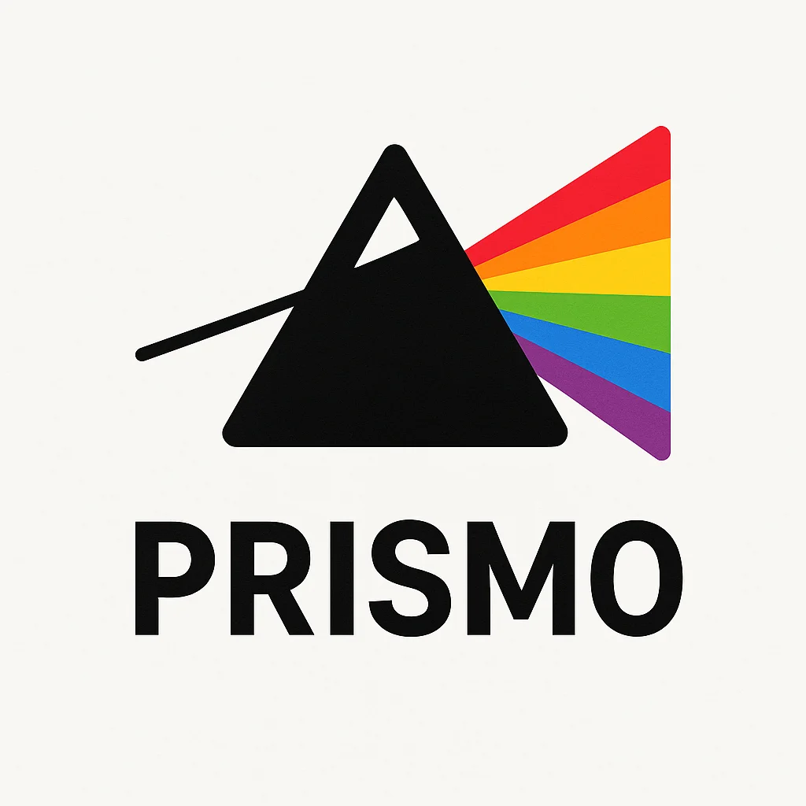

<p align="center">
  
</p>

<h1 align="center">Prismo</h1>

<p align="center">
  <strong>AI-powered pre-mortem analysis tool that refracts your architecture into a spectrum of risks.</strong>
</p>

<p align="center">
  <a href="https://www.npmjs.com/package/@srestack/prismo"></a>
  <a href="https://opensource.org/licenses/MIT"></a>
  <a href="https://nodejs.org/"></a>
  <a href="https://modelcontextprotocol.io/"></a>
</p>

<p align="center">
  <i>Just like a prism breaks white light into a visible spectrum, Prismo breaks your architecture into a spectrum of risks — revealing hidden failure modes, categorizing them by type, and making the invisible visible.</i>
</p>

---

## ✨ Features

| Feature | Description |
|---------|-------------|
| 🔍 **Architecture Analysis** | Refract any system architecture into failure modes |
| 📊 **FMEA Generation** | Auto-populate Failure Mode and Effects Analysis worksheets |
| 📈 **RPN Scoring** | Calculate Risk Priority Numbers (Severity × Occurrence × Detection) |
| 🎯 **Smart Mitigations** | Get tactical (do now) and strategic (plan) recommendations |
| 🔌 **MCP Integration** | Works seamlessly with Claude Desktop and other MCP clients |
| 🤖 **AI-Powered** | Uses Claude API for intelligent risk analysis |
| 📦 **Demo Mode** | Works without API key using pattern-based analysis |

---

## 🚀 Quick Start

### Option 1: Use with Claude Desktop

Add to your Claude Desktop config:

**Linux/Mac:** `~/.config/claude/claude_desktop_config.json`  
**Windows:** `%APPDATA%\Claude\claude_desktop_config.json`

```json
{
  "mcpServers": {
    "prismo": {
      "command": "npx",
      "args": ["@srestack/prismo"],
      "env": {
        "ANTHROPIC_API_KEY": "your-api-key-here"
      }
    }
  }
}
```

Then ask Claude: *"Analyze my web app architecture for risks"*

### Option 2: Run Locally

```bash
# Clone and install
git clone https://github.com/srestack/prismo.git
cd prismo
npm install

# Run demo
npm run demo

# Run tests
npm test

# Interactive CLI
npm run cli
```

---

## 🛠️ MCP Tools

Prismo exposes three tools via the Model Context Protocol:

### 1. `analyze_architecture`

Refract an architecture into failure modes.

```json
{
  "architecture": "Web app with React frontend, Node.js API, Redis cache, PostgreSQL database",
  "context": "E-commerce platform handling payments",
  "depth": "standard"
}
```

**Depth options:** `quick` (5-10 risks), `standard` (15-25 risks), `deep` (30+ risks)

### 2. `get_fmea`

Generate a complete FMEA worksheet.

```json
{
  "architecture": "Your system description here",
  "format": "markdown",
  "include_mitigations": true
}
```

**Format options:** `json`, `markdown`, `csv`

### 3. `calculate_rpn`

Calculate Risk Priority Number for a specific failure mode.

```json
{
  "severity": 9,
  "occurrence": 4,
  "detection": 7,
  "failure_mode": "Database connection timeout"
}
```

---

## 📊 Example Output

Given this architecture:
```
Library Management System with Web App, REST API, Redis Cache, 
MongoDB, and Key Vault for secrets.
```

Prismo generates:

| ID | Component | Failure Mode | S | O | D | RPN | Priority |
|----|-----------|--------------|---|---|---|-----|----------|
| RISK-001 | KEY-VAULT | Secret expiration not monitored | 9 | 4 | 7 | 252 | Critical |
| RISK-002 | DATABASE | Single instance (no replication) | 10 | 2 | 8 | 160 | Medium |
| RISK-003 | API | Rate limiting not implemented | 8 | 4 | 6 | 192 | Medium |
| RISK-004 | CACHE | Cache invalidation failure | 6 | 5 | 5 | 150 | Medium |

### Mitigation Example

**RISK-001: Secret expiration not monitored (RPN: 252)**

**Tactical (Do Now):**
- Document all secret expiry dates
- Set calendar reminders
- Create break-glass emergency access procedure

**Strategic (Plan):**
- Implement automated secret rotation
- Add expiry monitoring alerts (30/14/7 days before)
- Migrate to managed identities where possible

---

## 📐 RPN Scoring Guide

### The Formula

```
RPN = Severity × Occurrence × Detection
```

### Severity (S) - Business Impact

| Score | Meaning |
|-------|---------|
| 10 | Catastrophic - complete service failure |
| 7-9 | Major - significant customer impact |
| 4-6 | Moderate - degraded experience |
| 1-3 | Minor - barely noticeable |

### Occurrence (O) - Frequency

| Score | Meaning |
|-------|---------|
| 10 | Constant - happens daily |
| 7-9 | Frequent - weekly |
| 4-6 | Occasional - monthly |
| 1-3 | Rare - annually or never |

### Detection (D) - Monitoring

| Score | Meaning |
|-------|---------|
| 10 | No detection - customers report it |
| 7-9 | Poor - usually miss it |
| 4-6 | Moderate - sometimes catch it |
| 1-3 | Good - almost always catch it first |

### Priority Actions

| RPN Range | Priority | Action |
|-----------|----------|--------|
| 200-1000 | 🔴 Critical | Fix this sprint, escalate to leadership |
| 100-199 | 🟡 Medium | Plan within quarter |
| 50-99 | 🟢 Low | Add to backlog |
| 1-49 | ⚪ Minimal | Document and monitor |

---

## 💻 Development

### Prerequisites

- Node.js 18+
- npm

### Setup

```bash
git clone https://github.com/srestack/prismo.git
cd prismo
npm install
```

### Available Scripts

| Command | Description |
|---------|-------------|
| `npm run demo` | Run demo analysis |
| `npm test` | Run test suite (17 tests) |
| `npm run cli` | Interactive CLI |
| `npm run inspector` | MCP Inspector (browser) |
| `npm run build` | Build TypeScript |
| `npm run dev` | Run MCP server |

### VS Code

Press **F5** to see debug options:
- Run Demo
- Run Tests  
- Run Interactive CLI
- Run MCP Server

### Project Structure

```
prismo/
├── src/
│   ├── index.ts      # MCP server entry point
│   ├── analyzer.ts   # AI analysis engine
│   ├── fmea.ts       # FMEA worksheet generator
│   ├── rpn.ts        # RPN calculation
│   ├── cli.ts        # Interactive CLI
│   ├── demo.ts       # Demo script
│   └── test.ts       # Test suite
├── examples/         # Example configs
├── .vscode/          # VS Code debug configs
└── package.json
```

---

## ⚙️ Configuration

### Environment Variables

| Variable | Description | Required |
|----------|-------------|----------|
| `ANTHROPIC_API_KEY` | Claude API key for AI-powered analysis | No (uses demo mode if not set) |

### Demo Mode

Without an API key, Prismo runs in **demo mode** with pattern-based analysis. This is useful for testing and development.

---

## 🤝 Contributing

Contributions are welcome! See [CONTRIBUTING.md](CONTRIBUTING.md) for guidelines.

1. Fork the repository
2. Create your feature branch (`git checkout -b feature/amazing-feature`)
3. Run tests (`npm test`)
4. Commit your changes (`git commit -m 'Add amazing feature'`)
5. Push to the branch (`git push origin feature/amazing-feature`)
6. Open a Pull Request

---

## 📄 License

MIT License - see [LICENSE](LICENSE) for details.

---

## 🔗 Links

| Resource | Link |
|----------|------|
| 📖 Documentation | [srestack.dev/docs/prismo](https://srestack.dev/docs/prismo) |
| 📝 Blog Post | [Pre-Mortem Intelligence](https://srestack.dev/blog/prismo) |
| 🐙 GitHub | [github.com/srestack/prismo](https://github.com/srestack/prismo) |
| 📦 npm | [@srestack/prismo](https://www.npmjs.com/package/@srestack/prismo) |

---

## 💡 The Philosophy

> **"Fail on paper, not in production."**

```
QUALITY DEVELOPMENT LIFECYCLE

    [PREMORTEM] --> [HEARTBEAT] --> [RETROSPECTIVE] --> [POSTMORTEM]
        |              |                 |                   |
     Proactive      Monitor           Improve            Reactive
        ↑
     YOU ARE HERE (with Prismo)
```

---

<p align="center">
  Built with ❤️ by <a href="https://linkedin.com/in/santosh-swamynathan">Santosh Swamynathan</a>
</p>

<p align="center">
  <i>"Just like a prism reveals the hidden spectrum in white light, Prismo reveals the hidden risks in your architecture."</i>
</p>
